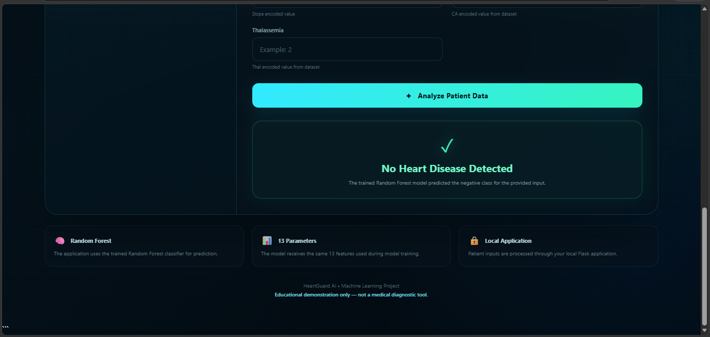
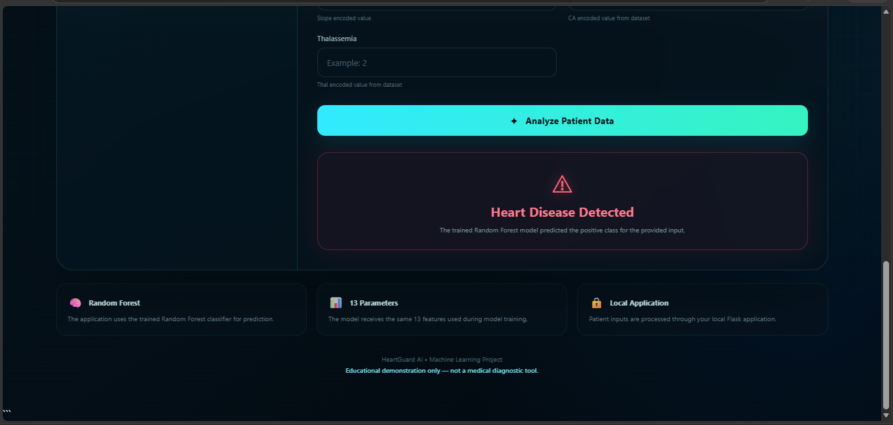

# ❤️ Heart Disease Prediction

A machine learning-powered web application that predicts the presence of heart disease based on 13 clinical parameters.

The project combines **Machine Learning, Flask, HTML and CSS** to provide a simple web interface where users can enter patient-related values and receive a model prediction.

> **Note:** This is an educational machine learning project and is not intended for medical diagnosis or clinical decision-making.

---

## 📌 Project Overview

Heart disease prediction is a classification problem where machine learning can be used to identify patterns in clinical data.

In this project, multiple machine learning algorithms were trained and evaluated. The **Random Forest Classifier** achieved an accuracy of **88.52%** on the test data and was integrated into a Flask web application.

The trained model is saved as a `.pkl` file and loaded by the Flask backend to generate predictions from user input.

---

## 🚀 Features

* User-friendly web interface
* 13 clinical input parameters
* Machine learning-based prediction
* Random Forest classification model
* Flask backend integration
* Real-time prediction result
* Responsive and modern UI
* Educational medical disclaimer

---

## 🧠 Machine Learning

The project uses the following machine learning algorithms:

| Model               | Accuracy |
| ------------------- | -------: |
| Logistic Regression |   86.89% |
| Decision Tree       |   73.77% |
| Random Forest       |   88.52% |
| K-Nearest Neighbors |   88.52% |

Based on the evaluated test accuracy, the trained **Random Forest Classifier** was integrated into the web application.

---

## 📊 Input Features

The model uses the following 13 parameters:

1. Age
2. Sex
3. Chest Pain Type (`cp`)
4. Resting Blood Pressure (`trestbps`)
5. Cholesterol (`chol`)
6. Fasting Blood Sugar (`fbs`)
7. Resting ECG (`restecg`)
8. Maximum Heart Rate (`thalach`)
9. Exercise Induced Angina (`exang`)
10. ST Depression (`oldpeak`)
11. Slope (`slope`)
12. Number of Major Vessels (`ca`)
13. Thalassemia (`thal`)

The input values follow the encoding used in the dataset.

---

## 🏗️ Application Architecture

```text
User
  ↓
HTML + CSS Frontend
  ↓
Flask Backend
  ↓
Load Trained Random Forest Model
  ↓
Process 13 Input Features
  ↓
Model Prediction
  ↓
Prediction Result
  ↓
Frontend
```

---

## 🛠️ Technologies Used

### Machine Learning

* Python
* Pandas
* Scikit-learn
* Joblib
* Google Colab

### Web Development

* Flask
* HTML
* CSS

---

## 📁 Project Structure

```text
Heart-Disease-Prediction/
│
├── app.py
├── heart_disease_random_forest.pkl
├── requirements.txt
├── README.md
│
├── templates/
│   └── index.html
│
├── notebook/
│   └── Heart_Disease_Prediction.ipynb
│
└── screenshots/
    ├── home.png
    ├── prediction_positive.png
    └── prediction_negative.png
```

---

## ⚙️ How to Run the Project

### 1. Clone the repository

```bash
git clone YOUR_GITHUB_REPOSITORY_URL
```

### 2. Open the project folder

```bash
cd Heart-Disease-Prediction
```

### 3. Install the required packages

```bash
pip install -r requirements.txt
```

### 4. Run the Flask application

```bash
python app.py
```

### 5. Open the application

Open the following address in your browser:

```text
http://127.0.0.1:5000
```

---

## 🖥️ Application Screenshots

### Home Page


### Heart Disease Prediction



### No Heart Disease Prediction



---

## 🔬 Model Integration

The trained Random Forest model is saved using Joblib:

```python
joblib.dump(forest_model, "heart_disease_random_forest.pkl")
```

The Flask application loads the saved model:

```python
model = joblib.load("heart_disease_random_forest.pkl")
```

The values submitted through the HTML form are converted into a Pandas DataFrame and passed to the trained model for prediction.

---

## 💡 What I Learned

Through this project, I gained practical experience in:

* Data preprocessing
* Machine learning classification
* Comparing multiple ML algorithms
* Random Forest model training
* Saving and loading trained ML models
* Flask backend development
* Connecting frontend forms with a backend
* Integrating a machine learning model into a web application

---

## ⚠️ Disclaimer

This project is developed for **educational and demonstration purposes only**.

The predictions generated by this application should not be considered medical advice, diagnosis, or treatment recommendations. Medical decisions should always be made by qualified healthcare professionals.

---

## 👩‍💻 Author

**Kaleeswari S**

B.E. Computer Science and Engineering

GitHub: **kaleeswari1**
